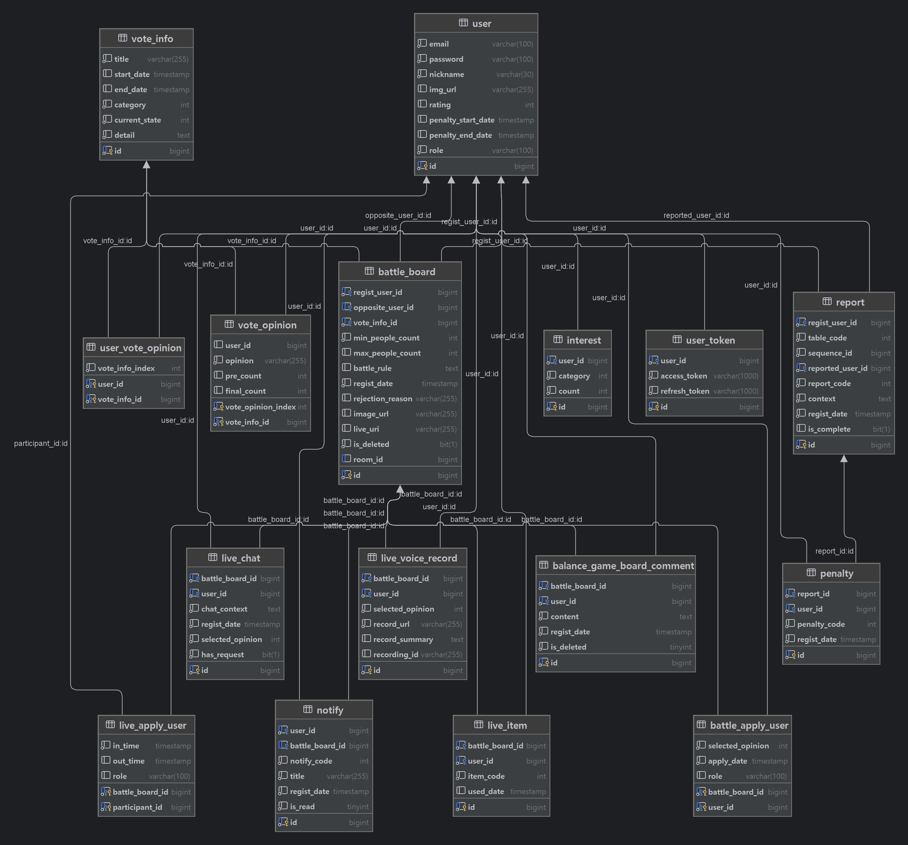
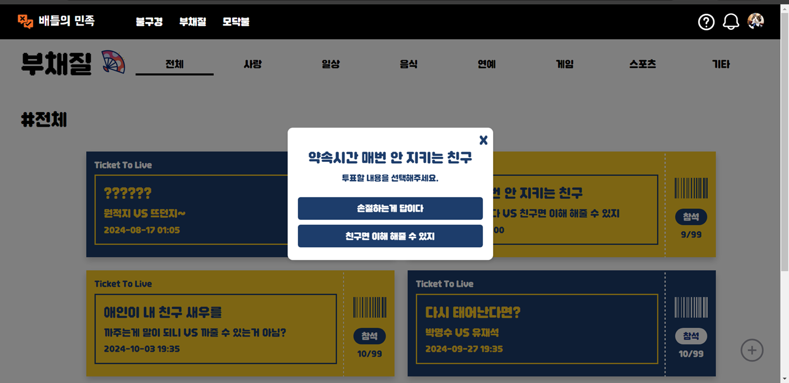
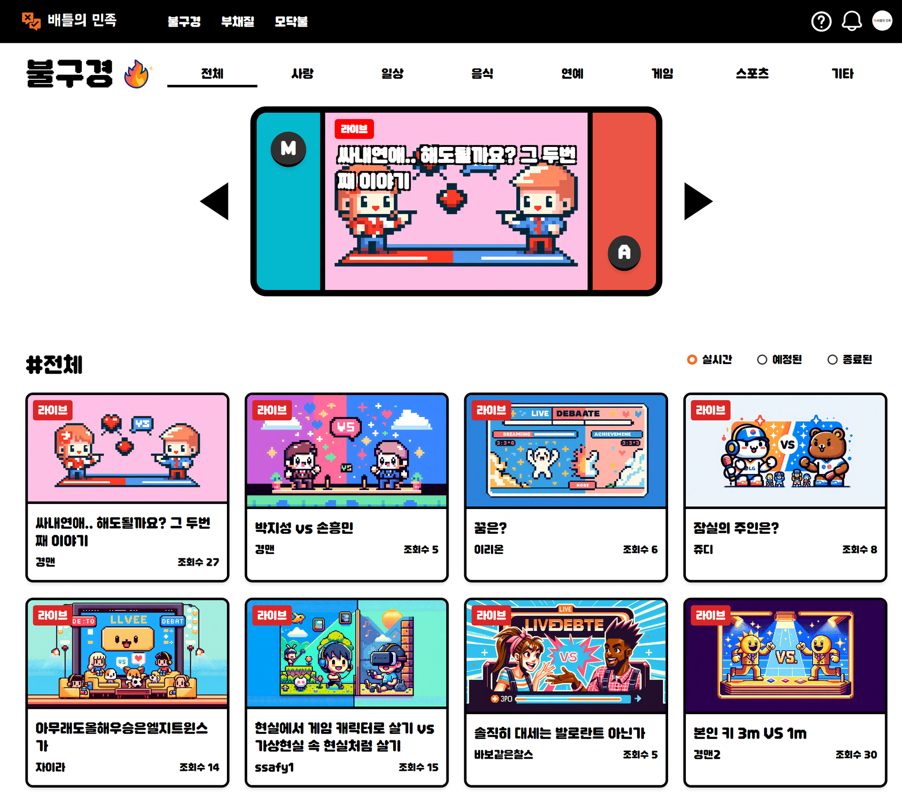
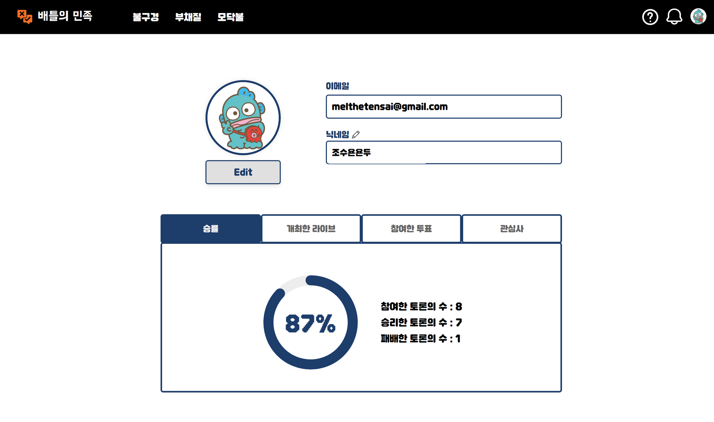

JDK: eclipse-temurin:17.0.11_9-jdk

## DB 덤프 파일

- [data.sql](./mysql/data.sql)

## 사용중인 외부 서비스

- OpenAI DALL·E API

## 설정 정보 파일 목록

- [백엔드 설정 파일](./backend/application.properties)
- [백엔드 설정 환경변수](./backend/.env)
- [openvidu 환경변수](./.env.openvidu)
- [mysql 계정 설정 파일](./mysql/init.sql)
- [도메인 인증서](./cert)

## 필수 환경변수

- OpenAI DALL·E 사용을 위한 API 키 (backend/.env 파일에 설정)
- (도메인 변경 시)
  - backend/.env의 OPENVIDU_URL
  - .env.openvidu의 DOMAIN_OR_PUBLIC_IP
  - SSL 인증서 변경(cert 폴더에서 certificate.cert, certificate.key 변경)

## 필수 파일

- SSL 인증서
  - cert폴더 안에 certificate.cert, certificate.key의 이름을 가지도록 설정

## 간편 구성

```bash
sh init.sh
```

## 로컬 환경에서 간편 구성

```
sh init.local.sh
```

# 프로젝트 구성

```bash
project-root/
├── backend/
│   └── build/
│   │   └── [backend JAR files]
│   └── aplication.properties
│   └── .env
├── frontend/
│   └── build/
│       └── [frontend build files]
├── mysql/
│   └── init.sql
│   └── data.sql
├── nginx/
│   └── nginx.conf
└──docker-compose.yml
```


# Openvidu 구성

```bash
sudo su
cd /opt
curl https://s3-eu-west-1.amazonaws.com/aws.openvidu.io/install_openvidu_latest.sh | bash

cd /opt/openvidu
# 이후 아래의 .env 파일 설정값 적용
```

.env (/opt/openvidu/.env 파일에서 해당 내용만 수정)

```bash
DOMAIN_OR_PUBLIC_IP=i11a706.p.ssafy.io
OPENVIDU_SECRET=p4syQOj0dxoTTeRO0gptkNwnd
CERTIFICATE_TYPE=owncert
SUPPORT_DEPRECATED_API=false
OPENVIDU_RECORDING=true
```

/opt/openvidu/owncert 폴더에 인증서 파일 추가

```bash
ls /opt/openvidu/owncert/
# certificate.cert  certificate.key
```

이후 도커 컨테이너 실행

```bash
cd /opt/openvidu
docker compose up -d
```

docker-compose.yml

```bash
services:
  nginx:
    image: nginx
    container_name: nginx
    restart: always
    ports:
      # openvidu nginx 설정은 localhost:5442로 일반 트래픽 전송
      - "127.0.0.1:5442:80"
    volumes:
      - ./nginx/nginx.conf:/etc/nginx/conf.d/default.conf:ro
      - ./frontend/build:/usr/share/nginx/html:ro
      - ./images:/static/images:ro
    networks:
      - rabbits

  backend:
    image: eclipse-temurin:17.0.11_9-jdk-jammy
    container_name: backend
    restart: always
    depends_on:
      - mysql
    environment:
      - SPRING_CONFIG_LOCATION=/app/application.properties
    volumes:
      - ./backend/build/battlepeople.jar:/app/app.jar:ro
      - ./backend/application.properties:/app/application.properties
      - ./images:/static/images:rw
    env_file:
      - backend/.env
    working_dir: /app
    networks:
      - rabbits
    entrypoint: ["sh", "-c", "java -jar $(ls *.jar | head -n 1)"]

  mysql:
    image: mysql:8.0.33
    container_name: mysql
    restart: always
    environment:
      MYSQL_ROOT_PASSWORD: VhGjVihJtfVUzhsT7m8y
      MYSQL_DATABASE: battlepeople
    volumes:
      - mysql_data:/var/lib/mysql
      - ./mysql/init.sql:/docker-entrypoint-initdb.d/init.sql
      - ./mysql/data.sql:/docker-entrypoint-initdb.d/initdata.sql
    networks:
      - rabbits

  redis:
    image: redis
    container_name: redis
    restart: always
    networks:
      - rabbits

networks:
  rabbits:
    driver: bridge

volumes:
  mysql_data:

```

nginx.conf

```bash
server {
    listen 80;

    location = /battle-people/ws {
        proxy_pass http://backend:8080;
        proxy_http_version 1.1;
        proxy_set_header Upgrade $http_upgrade;
        proxy_set_header Connection "upgrade";
        proxy_set_header Host $host;
        proxy_set_header X-Real-IP $remote_addr;
        proxy_set_header X-Forwarded-For $proxy_add_x_forwarded_for;
        proxy_set_header X-Forwarded-Proto $scheme;
        proxy_set_header X-Original-Forwarded-For $http_x_forwarded_for;
        proxy_read_timeout 86400;
    }

    location /battle-people {
        proxy_pass http://backend:8080;
        proxy_set_header Host $host;
        proxy_set_header X-Real-IP $remote_addr;
        proxy_set_header X-Forwarded-For $proxy_add_x_forwarded_for;
        proxy_set_header X-Forwarded-Proto $scheme;
        proxy_set_header X-Original-Forwarded-For $http_x_forwarded_for;
    }

    location /static/images/ {
        alias /static/images/;
        try_files $uri $uri/ =404;
    }

    location / {
        root /usr/share/nginx/html;
        index index.html;
        try_files $uri $uri/ /index.html;
    }
}
```

backend/application.properties

```bash
spring.application.name=BattlePeople
server.port=8080
server.servlet.context-path=/battle-people
springdoc.api-docs.path=/v3/api-docs
springdoc.swagger-ui.path=/swagger-ui.html
#data source
spring.datasource.url=${SPRING_DATASOURCE_URL}
spring.datasource.driver-class-name=com.mysql.cj.jdbc.Driver
spring.datasource.username=${SPRING_DATASOURCE_USERNAME}
spring.datasource.password=${SPRING_DATASOURCE_PASSWORD}
spring.jpa.database=mysql
spring.jpa.properties.hibernate.dialect=org.hibernate.dialect.MySQLDialect
#jwt
jwt.secret=${JWT_SECRET}
# 10 days
jwt.accessToken.expiration=864000000
# 10 days
jwt.refreshToken.expiration=864000000
#hibernate
spring.jpa.show-sql=false
spring.jpa.hibernate.ddl-auto=none
spring.jpa.hibernate.format_sql=true
spring.output.ansi.enabled=always
#logging
#logging.level.org.hibernate.type=trace
openvidu.url=${OPENVIDU_URL}
openvidu.secret=${OPENVIDU_SECRET}
# OpenVidu recording properties
openvidu.recording=true
openvidu.recording.path=/opt/openvidu/recordings
openvidu.recording.public-access=true
spring.data.redis.host=redis
spring.data.redis.port=6379

min.people.count.value=5

spring.servlet.multipart.enabled=true
spring.servlet.multipart.file-size-threshold=2KB
spring.servlet.multipart.max-file-size=200MB
spring.servlet.multipart.max-request-size=215MB
storage.location=/static/images

openai.api.key=${OPENAI_API_KEY}
```

backend/.env

```bash
OPENAI_API_KEY=""
OPENVIDU_URL="https://i11a706.p.ssafy.io"
OPENVIDU_SECRET="p4syQOj0dxoTTeRO0gptkNwnd"
JWT_SECRET="adsfasdfasdfasdfasdfasdfkjasdlkfjaslkdfjlaskdjffghdfhrtbfgbxcvbxfbserbcvbxcvb"
SPRING_DATASOURCE_URL="jdbc:mysql://mysql:3306/battlepeople?serverTimezone=Asia/Seoul&characterEncoding=UTF-8"
SPRING_DATASOURCE_USERNAME="rabbits"
SPRING_DATASOURCE_PASSWORD="kevinhomealone"
```

mysql/init.sql



```sql
CREATE DATABASE IF NOT EXISTS battlepeople;

-- Create admin user
CREATE USER 'bunnies'@'%' IDENTIFIED BY 'VhGjVihJtfVUzhsT7m8y';
FLUSH PRIVILEGES;
GRANT ALL PRIVILEGES ON *.* TO 'bunnies'@'%';

-- Create developer user
CREATE USER 'rabbits'@'%' IDENTIFIED BY 'kevinhomealone';
GRANT SELECT, INSERT, UPDATE, DELETE ON battlepeople.* TO 'rabbits'@'%';

FLUSH PRIVILEGES;

DROP USER 'root'@'%';

FLUSH PRIVILEGES;

```

# 시연 시나리오

### 1. 메인 페이지


   1. **헤더 설명:** 메인 페이지의 상단에 위치한 헤더는 사이트의 주요 탐색 도구로, 다양한 기능에 빠르게 접근할 수 있도록 구성되어 있습니다.
   2. **도움말 버튼:** 헤더 내 '도움말' 버튼을 클릭하면, 사이트 이용에 대한 간략한 설명이 제공됩니다.


### 2. 밸런스 게임


   1. **카테고리 탐색:** 전체 및 각 카테고리별로 밸런스 게임을 선택하여 확인할 수 있습니다.

   2. **세부 항목 클릭:** "최고의 예능은?" 항목을 클릭하여 상세 모달을 확인합니다.


   3. **밸런스 게임 만들기:** 밸런스 게임 생성 시 '라이브 만들기' 기능과 간단히 비교한 후, 밸런스 게임을 생성합니다.

### 3. 알림


   1. **배틀 요청 알림:** A 사용자가 B 사용자에게 배틀 요청을 보내는 알림이 토스트 메시지로 표시됩니다.
   2. **알림 확인 및 수락:** 사용자는 알림을 확인하고, 배틀 선택지를 작성한 후 배틀을 수락합니다.

### 4. 부채질

   1. **배틀 참석 신청:** 사용자가 수락한 배틀에 참석 신청을 클릭하지만, 본인이 생성한 배틀에는 참석 신청이 불가합니다.



   2. **사전투표 및 새로고침:** "출퇴근 시 뭐가 나음?" 항목에 사전투표를 한 후, 새로고침을 클릭하여 정원이 다 채워진 후 항목이 사라지는 것을 확인합니다.
   3. **배틀 진행 설명:** "싸내연애 그 세번째 이야기" 배틀은 최소 인원이 채워져 배틀 시작 시간에 자동으로 진행 중으로 상태가 변경됩니다.

### 5. 불구경


   1. **예정 중 탭:** '예정 중' 탭에서 "출퇴근 시 뭐가 나음?" 라이브 썸네일을 클릭하여 예정된 라이브로 이동합니다.
   2. **진행 중 탭:** '진행 중' 탭에서 "싸내연애 그 세번째 이야기"가 진행 중인 것을 확인합니다.


   3. **라이브 참여:** "싸내연애 그 세번째 이야기" 라이브에 참여하여 마이크를 켜고 발언합니다.
       1. **실시간 투표 확인:** 실시간 투표 결과를 확인하며, 투표 변동 사항이 보이지 않을 경우 새로고침을 통해 업데이트 상태를 확인합니다.
       2. **채팅 참여:** 발언자와 팀원이 채팅을 통해 투표에 참여하며, 결과에 따라 화면 색상이 변하는 것을 설명합니다.
       3. **투표 종료:** 투표 결과가 발표되고 라이브가 종료됩니다.
   4. **메인 화면으로 이동:** 라이브 종료 후 메인 화면으로 이동합니다.

### 6. 마이페이지

   1. **승률 확인:** 방금 진행한 배틀에서 승리하여 승률이 100%가 된 것을 확인합니다.
   2. **기록 확인:** 마이페이지에서 사용자의 기록을 확인합니다.
   3. **닉네임 변경:** 닉네임을 변경합니다.
